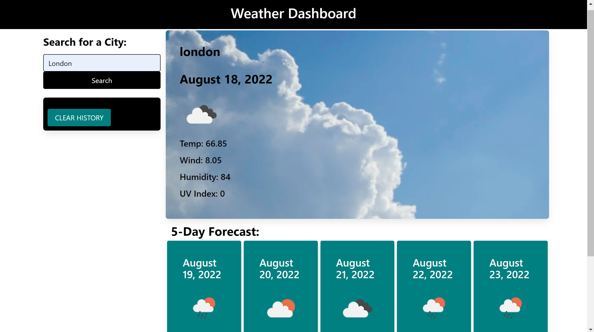

# Weather-Dashboard

### Netlify: weather-dashboard-818b80.netlify.app

## About:
- For traveler, it is presented with current and future conditions for that city.
- It shows a 5-day forecast that are display, the date, an icon representation of weather conditions, the temperature, the wind speed, and the humidity.

## Visuals:

 

## User Story:

<pre>AS A traveler
I WANT to see the weather outlook for multiple cities
SO THAT I can plan a trip accordingl</pre>

## Acceptance Criteria:

<pre><b>GIVEN</b> a weather dashboard with form inputs
<b>WHEN</b> I search for a city
<b>THEN</b> I am presented with current and future conditions for that city and that city is added to the search history
<b>WHEN</b> I view current weather conditions for that city
<b>THEN</b> I am presented with the city name, the date, an icon representation of weather conditions, the temperature, the humidity, the wind speed, and the UV index
<b>WHEN</b> I view the UV index
<b>THEN</b> I am presented with a color that indicates whether the conditions are favorable, moderate, or severe
<b>WHEN</b> I view future weather conditions for that city
<b>THEN</b> I am presented with a 5-day forecast that displays the date, an icon representation of weather conditions, the temperature, the wind speed, and the humidity
<b>WHEN</b> I click on a city in the search history
<b>THEN</b> I am again presented with current and future conditions for that city</pre>

### Missing from acceptance criteria: 
- localStorage
- Search history
- When view the UV index, it should be presented with a color that indicates whether the conditions are favorable.

### Data:

The application uses the following data inputs: 
- Weather information is provided by the OpenWeather <a href="https://openweathermap.org/" rel="nofollow"> OpenWeatherMap API </a>

### Build:
- This site is build using <a href="https://bulma.io/documentation/"> Bulma documentation

